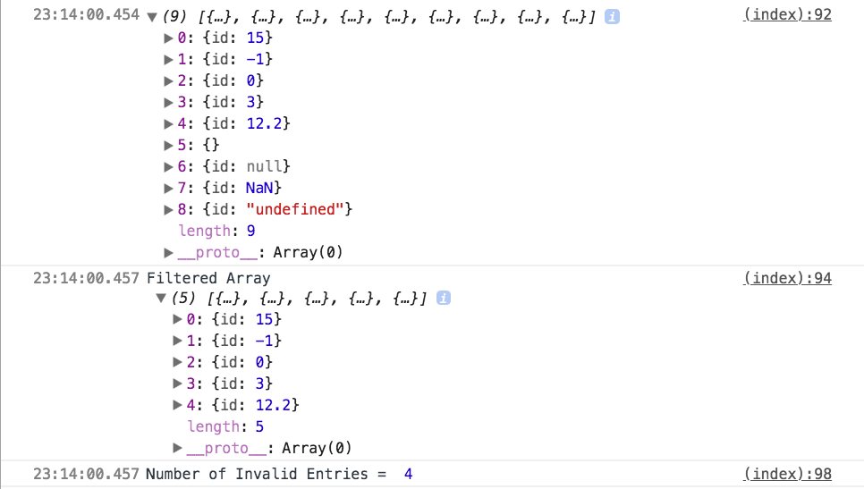

# \[JS\] filter

참고 : 해당 내용은 리액트 도움 닫기를 참고하여 내용을 기술 하였습니다. 

{% embed data="{\"url\":\"https://developer.mozilla.org/ko/docs/Web/JavaScript/Reference/Global\_Objects/Array/filter\",\"type\":\"link\",\"title\":\"Array.prototype.filter\(\)\",\"description\":\"filter\(\) 메소드는 제공된 함수로 구현된 테스트를 통과하는 모든 요소가 있는 새로운 배열을 만듭니다.\",\"icon\":{\"type\":\"icon\",\"url\":\"https://developer.mozilla.org/static/img/favicon144.e7e21ca263ca.png\",\"width\":144,\"height\":144,\"aspectRatio\":1},\"thumbnail\":{\"type\":\"thumbnail\",\"url\":\"https://developer.mozilla.org/static/img/opengraph-logo.72382e605ce3.png\",\"width\":600,\"height\":600,\"aspectRatio\":1}}" %}


\(문제가 될 시 삭제 하도록 하겠습니다.\)

**filter**

리액트에서 함수를 활용하여 배열의 엘리먼트 삭제 할 수 있습니다.

이 함수는 배열을 반복해 엘리먼트마다 접근하여 필터 조건에 따라 배열의 각 엘리먼트를 대조합니다.

서로 값이 일치하면 배열은 그대로 유지.

일치 하지 않으면 배열에서 필터링됩니다. 

반환되는 배열은 원래 배열 값을 변경하지 않는 불변 데이터 구조 !!

**구문**

var new\_array = arr.filter\(callback,\[, thisArg\]\);

**매개변수**

1\) callback

배열의 각 요소를 테스트하는 함수. 인수\(element, index, array\)함께 호출됨.

요소를 **새 배열**에 계속 두기 위해 true를 반환, 그렇지 않으면 false.

2\) thisArg

옵션적인 사항. callback를 실행할 때 this로 사용하는 값.

**반환값**

매개변수로 넘긴 callback파라미터를 통해 넘겨 받은 true 로 넘어온 값들이 있는 **새로운 배열**

\(MDN에서는 테스트를 통과한 요소가 있는 새로운 배열이라고 나와 있는데, 테스트라는 의미가 조금은 낯설거나 

익숙하지 않아서 다시 풀어서 기입을 하였습니다.\)

**설명**

배열 내 각 요소에 대해 한 번 제공된 callback함수를 호출해 , callback이 true로 강제하는 값을 반환하는 모든 값이 있는 새로운 배열을 생성함.

callback은 할당된 값이 있는 배열의 인덱스에 대해서만 호출이 됨. 삭제 됐거나 값이 할당된 적이 없는 인덱스에 대해서는 호출되지 않음. callback에서 넘겨 받지 못한 배열 요소는 그냥 건너 뛰며 새로운 배열에 포함되지 않음.

callback은 다음 세 인수와 함께 호출이 됨.

1. 요소값
2. 요소 인덱스
3. 순회되는 배열 객체

thisArg 매개 변수가 filter에 제공된  경우, 호출될 때 callback에 전달됨.

this값으로 쓰기 위해. 그렇지 않으면 undefined값이 this값으로 쓰기 위해 전달됨.

callback에 의해 관찰할 수 있는 this는 함수에 의해 보이는 this를 결정하는 평소 규칙에 따라 결정됨.

filter\(\)는 호출되는 배열을 변화시키지 않음.\(mutate !!\)

filter에 의해 처리되는 요소의 범위는 callback의 첫 호출 전에 설정됨.

filter호출 시작 이후로 배열에 추가된 요소는 callback에 의해 방문되지 않음.

배열의 기존 요소가 변경 또는 삭제된 경우 callback에 전달된 그 값은  filter가 그 요소를 방문한 시점에 값이 됨.

삭제된 요소는 반영되지 않음.

```javascript
var arr = [
  { id: 15 },
  { id: -1 },
  { id: 0 },
  { id: 3 },
  { id: 12.2 },
  { },
  { id: null },
  { id: NaN },
  { id: 'undefined' }
];

var invalidEntries = 0;

function filterByID(obj) {
  if ('id' in obj && typeof(obj.id) === 'number' && !isNaN(obj.id)) {
    return true;
  } else {
    invalidEntries++;
    return false;
  }
}

var arrByID = arr.filter(filterByID);

console.log(arr);

console.log('Filtered Array\n', arrByID);
// Filtered Array
// [{ id: 15 }, { id: -1 }, { id: 0 }, { id: 3 }, { id: 12.2 }]

console.log('Number of Invalid Entries = ', invalidEntries);
// Number of Invalid Entries = 4
```




